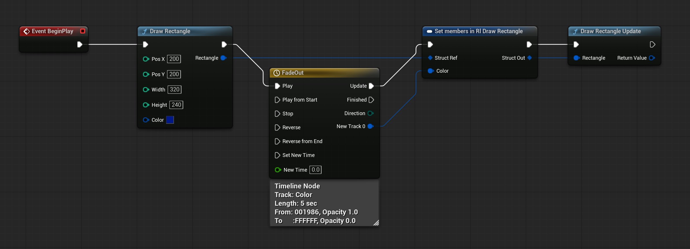
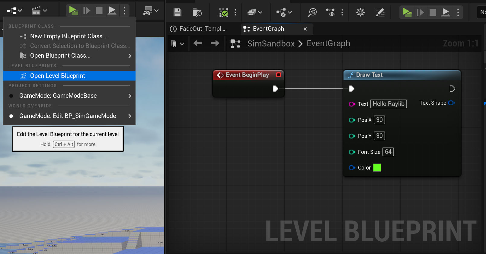
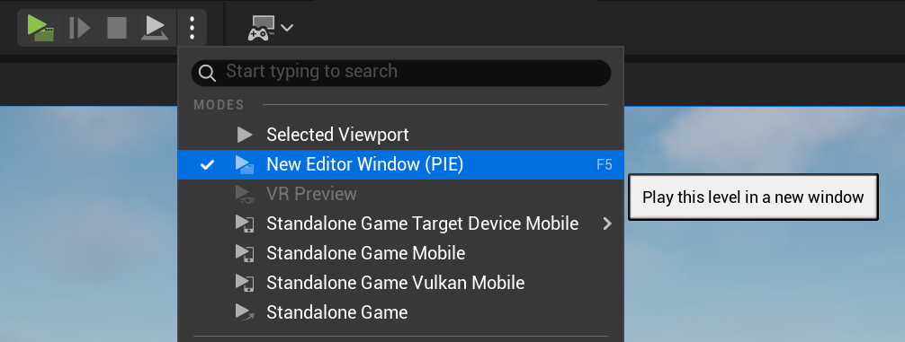
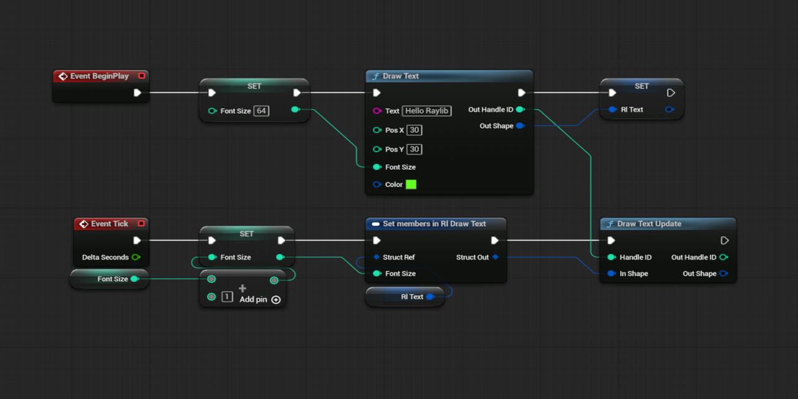

     .----------------.  .----------------.  .----------------. 
    | .--------------. || .--------------. || .--------------. |
    | |  ________    | || |  _________   | || |  ____  ____  | |
    | | |_   ___ `.  | || | |_   ___  |  | || | |_  _||_  _| | |
    | |   | |   `. \ | || |   | |_  \_|  | || |   \ \  / /   | |
    | |   | |    | | | || |   |  _|      | || |    > `' <    | |
    | |  _| |___.' / | || |  _| |_       | || |  _/ /'`\ \_  | |
    | | |________.'  | || | |_____|      | || | |____||____| | |
    | |              | || |              | || |              | |
    | '--------------' || '--------------' || '--------------' |
     '----------------'  '----------------'  '----------------' 

           DarknessFX @ https://dfx.lv | X : @DrkFX

# RaylibUE Plugin For Unreal Engine


## About

RaylibUE plugin seamlessly bridges [Raylib](https://www.raylib.com/)'s powerful 2D/3D drawing API with [Unreal Engine](https://www.unrealengine.com)'s intuitive Blueprint system. Draw shapes, text, lines, textures and more, directly on your game viewport via transparent overlay, no code barriers.

## Why RaylibUE?

- Educational Stating Point: Ideal for teachers and students, learn with Raylib's simplicity alongside Unreal Engine's depth, from basic shapes to 3D models.
- Raylib Fidelity: 50+ Raylib draw functions as Blueprint nodes *(e.g., DrawCircle, DrawText, DrawModelEx)* with exact parameters for 1:1 learning.
- Independent Rendering: RaylibUE uses Raylib graphics API *(OpenGL)*, running independent of Unreal Engine’s graphics settings, and fully compatible with DirectX 11, DirectX 12 and Vulkan projects.
- Non-Intrusive Overlay: Renders to an independent overlay window atop the Unreal Engine game viewport, syncing on resize, move, maximize or minimize, while preserving Unreal Engine input, focus and performance.
- Command Buffer: Queue and update render draw commands with handles, reorder, purge by type, or bulk-set commands for real-world renderer pipeline practice.

## Features
| Category | Highlights |
|----------|------------|
| **2D Basics** | Pixels, lines, circles, rects w/ gradients/rounding |
| **Text** | Dynamic fonts, texture fonts, codepoints, pro transforms |
| **3D** | Spheres, cubes, cylinders, models w/ wires |
| **Textures** | Billboard, NPatch, pro UVs |
| **Utils** |  Camera, FPS counter, grid, ray |

- **Blueprint Chain**: All nodes return OutShape pins, allowing direct connection to Update nodes for zero-friction development.


- **C++ Friendly**: Static calls, e.g., `URaylibUEBPLibrary::DrawPixel(10, 10, FLinearColor::Red, ID, Shape);`.
```cpp
#include "RaylibUEBPLibrary.h"
FRlDrawText rlText;
URaylibUEBPLibrary::DrawText("Hello RaylibUE!", 100, 100, 24, FLinearColor::Yellow, rlText);
```

##  Installing from Releases page

If you are using Unreal Engine **4.27.2** or **5.6.1** and don't want to build the plugin from source, you can go to the 
[Releases](https://github.com/DarknessFX/RaylibUE/releases/latest) page and download the ready-to-use binary version.<br/>
Just unzip the file into your project folder and open your .uproject.<br/>
The engine will enable and load RaylibUE, you can start using it immediately.<br/>

 ## Building from source

1. git clone https://github.com/darknessfx/RaylibUE.git
2. Create a new Unreal Engine C++ Project named *YourProject*.
3. Create a new folder named *Plugins* at *YourProject/*.
4. Copy **RaylibUE** to *YourProject/Plugins/* folder.
5. Regenerate project files. (right-click *YourProject.uproject* and Generate Project Files).
6. Open *YourProject.uproject* and reply **Yes** to buld the project.
<br/><br/>
> __Dependencies :__
>- Windows *(WinAPI overlay)*
>- Unreal Engine 4.25+ and 5.0+ *(Tested on 4.27.2 and 5.6.1)*.
>- Raylib library is bundled.
>- Visual Studio or VS Code to build from source, more information at [Unreal Engine: Setting Up Visual Studio](https://dev.epicgames.com/documentation/en-us/unreal-engine/setting-up-visual-studio-development-environment-for-cplusplus-projects-in-unreal-engine) and [Setting Up Visual Studio for Unreal Engine](https://dev.epicgames.com/documentation/en-us/unreal-engine/unreal-engine-5-6-documentation).


##  Quick start

<br/>

1. Open Level Blueprint.
2. Event BeginPlay, add a new node: Raylib DrawText.
3. Set DrawText node to Text "Hello Raylib", PosX 30, PosY 30, FontSize: 64, Color: Green
4. Play in a **New Editor Window (PIE)**.

<br/>

Next Step: See the image below to make your text grow each frame.


##  Sample
*(Under construction)*

## Credits

[Unreal Engine](https://www.unrealengine.com/) from Epic Games.<br/>
[RayLib](https://www.raylib.com/) from Ramon Santamaria (X : [@raysan5](https://x.com/raysan5)).<br/>


## License

@MIT - Free for everyone and any use. <br/><br/>
DarknessFX @ [https://dfx.lv](https://dfx.lv) | X : [@DrkFX](https://x.com/DrkFX)
<br/>
https://github.com/DarknessFX/RaylibUE
